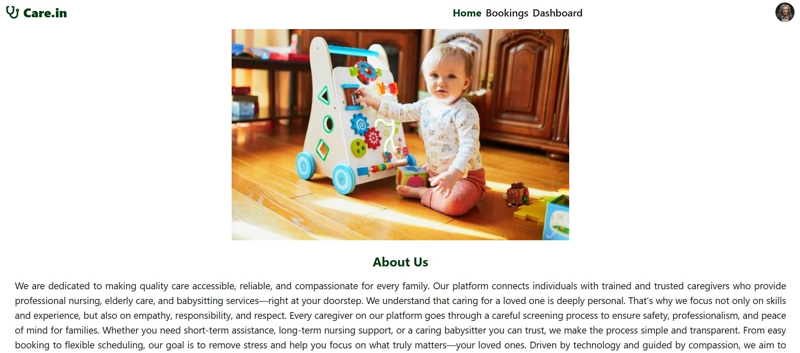
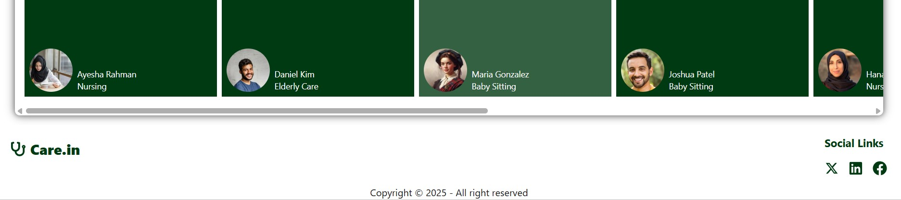

<p align="center">
  
  
  
</p>

---

# 🚀 Care.in

A website for hunting caregivers.

👉 **[Live Demo](https://nextjs-shoaib221.vercel.app/)**

---

## ✨ Features
- ⚡ Admins can create and update caregiving services
- ⚡ Users can search for services according to their preferred location & time span
- ⚡ Users can book services and complete payment 

---

## 🧰 Tech Stack

- Next.js  
- Tailwind CSS & daisyUI
- MongoDB
- Stripe payment gateway
- Next Auth  

---

## 📦 Packages Used
- swiper.js
- mongoose
- swiper
- framer motion
- react-toastify 

---

## 🧑‍💻 Setup Instructions

```bash

git clone https://github.com/shoaib221/B12-A11-category-02.git
cd Care.in
npm install
npm run dev


